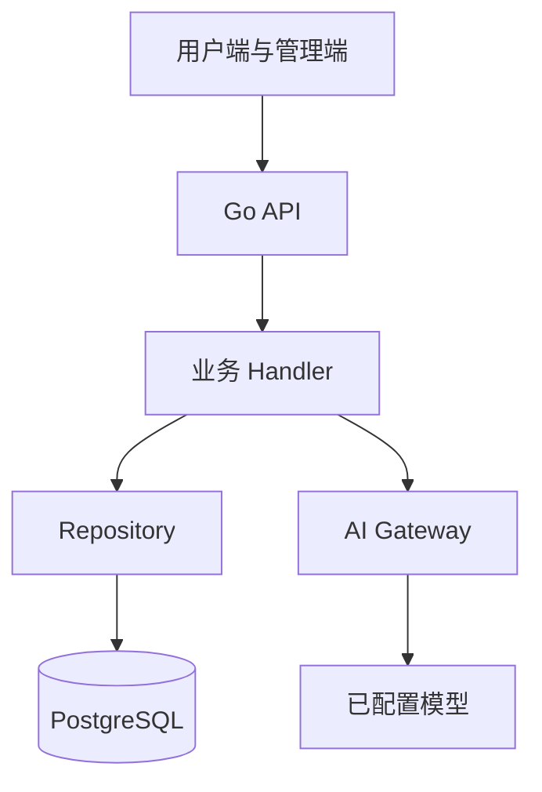

# 第一阶段生产功能修复技术设计

Feature Name: first-12-production-fixes
Updated: 2026-07-24

## Description

修复管理端和用户端当前已存在功能的数据契约、数据库查询、计费原子性、配置项和主题入口，使页面状态由真实后端数据驱动。

## Architecture

后端先统一返回字段，再同步修正前端类型和展示逻辑。任务创建在一个数据库事务中校验模型、扣除积分、创建任务；多个模型作为独立执行单元保存，任务进度由完成单元数和总单元数计算。

## Components and Interfaces

- `task`：解析模型列表、创建任务、删除任务及答案、更新进度。
- `aimodel`：提供模型配置名称、统计聚合和平均延迟。
- `order`：修正列表查询字段与扫描映射。
- `cdk`：校验并生成 CDK，处理唯一约束错误。
- `payment`：增加渠道字段，前后端统一易支付参数。
- `setting`：将短信宝纳入服务商配置模型。
- 三个前端应用：增加主题切换入口，统一中文错误和空状态。

## Data Models

- `ai_tasks.model` 保存实际执行模型；多模型任务按模型拆分执行记录或按逗号协议兼容已有数据。
- `ai_tasks.questions_count` 表示总执行单元，`completed_count` 表示已完成单元。
- `ai_tasks.total_tokens`、`total_cost`、延迟字段用于统计聚合；缺失字段通过迁移补齐。
- `payment_configs.channel` 保存默认支付渠道。
- 短信配置继续使用设置表，`sms_provider=smsbao` 时读取 `smsbao_username` 和 `smsbao_password`。

## Correctness Properties

1. 任务创建成功后，积分减少量等于有效模型数量。
2. 任务创建失败后，用户积分保持原值。
3. 任务进度始终位于 0 到 100 之间，已完成任务为 100，失败任务保留实际完成比例。
4. 订单列表 SQL 返回字段数量与扫描目标数量一致。
5. 所有用户端统计只聚合当前用户可访问的数据。

## Error Handling

- 数据库错误记录服务端上下文日志，接口返回统一中文错误。
- 重复 CDK、余额不足、无可用模型、无权限和资源不存在分别返回对应 HTTP 状态。
- 前端保留加载、错误、空数据三种状态，避免使用演示数据填充真实页面。

## Test Strategy

- Go 单元测试覆盖模型解析、积分计算、进度计算、CDK 校验和易支付参数生成。
- Repository 查询使用可执行的集成测试或 SQL 静态检查验证字段映射。
- 前端执行 `typecheck`、`lint` 和三个应用的 production build。
- 启动官网开发服务，通过受支持 Host 验证 `allowedHosts` 配置。
